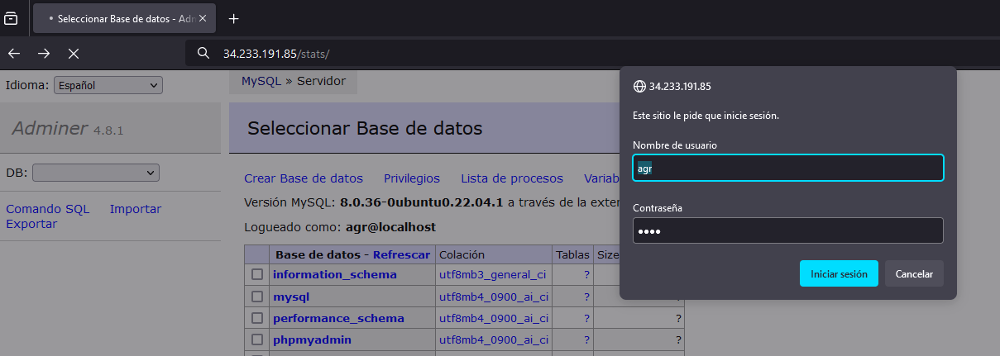

# Instalacion pila LAMP
LAMP es el acrónimo usado para describir un sistema de infraestructura de Internet que usa las siguientes herramientas:

- Linux (Sistema Operativo)
- Apache (Servidor Web)
- MySQL/MariaDB (Sistema Gestor de Bases de Datos)
- PHP (Lenguaje de programación)

Gracias a aws tenemos una maquina ubuntu en la que trabajar por lo que la parte de linux ya esta cubierta. Por eso estaremos trabajando en consola de linux.

## Instalacion Aplicaciones
Siempre que vayamos a instalar algo tenemos que actualizar los paquetes

### Actualizamos los paquetes
```
apt update
``` 

### Actualizamos aplicaciones
```
apt upgrade -y
```

## Instalar Apache
Comando de instalacion Apache `-y` para que no te pida confirmacion.
```
apt install apache2 -y
```


## Instalar MySQL 
Comando de instalacion MySQL `-y` para que no te pida confirmacion. 
```
apt install mysql-server -y
```

## Instalar PhP 
Comando de instalacion de php y los modulos necesarios para conectarlo con Apache y MySQL, el `-y` para que no te pida confirmacion.  
```
apt install php libapache2-mod-php php-mysql -y
```

## Copiar archivo de conf 
Con esto conseguimos que Apache tenga la configuracion que tenemos en el repositorio.  
```
cp ../conf/000-default.conf /etc/apache2/sites-available
```
En la con figuracion tenemos varias cosas interesantes `ServerSignature` y `ServerTokens` sirve para que no salga la version de Apache ni en la cabezera ni al final de la practica.`DirectoryIndex` elegimos el orden en el que Apache va a elegir los index. `AllowOverride All` para poder utilizar htaccess.
```
ServerSignature off
ServerTokens Prod

<VirtualHost *:80>
    #ServerName www.example.com
    DocumentRoot /var/www/html
    DirectoryIndex index.php index.html
    <Directory "/var/www/html/stats">
        AllowOverride All
    </Directory>
    ErrorLog ${APACHE_LOG_DIR}/error.log
    CustomLog ${APACHE_LOG_DIR}/access.log combined
  </VirtualHost>
  ```
## Copiar index
Nuestro index.php pasa a estar en la carpeta donde apache mira su html.
```
cp ../php/index.php /var/www/html
```  
## Modificar  propietario de /var/www/html al de apache
Este comando es necesario para que apache funcione correctamente. `www-data` es el usuario de apache y le damos el propietario de la carpeta donde estan nuestros html.
```
chown -R www-data:www-data /var/www/html
```
### Pagina Funcionando


## Instalacion de Herramientas 
Ademas de instalar phpMyAdmin vamos a instalar una herramientas adicionales relacionadas con administracion y/o servicios. 
### Instalar phpMyAdmin
phpMyAdmin es una herramienta que proporciona una interfaz gráfica web para administrar y gestionar bases de datos MySQL.
#### Instalar phpmyadmin de forma automatizada
```
echo "phpmyadmin phpmyadmin/reconfigure-webserver multiselect apache2" | debconf-set-selections
echo "phpmyadmin phpmyadmin/dbconfig-install boolean true" | debconf-set-selections
echo "phpmyadmin phpmyadmin/mysql/app-pass password $PHPMYADMIN_APP_PASSWORD" | debconf-set-selections
echo "phpmyadmin phpmyadmin/app-password-confirm password $PHPMYADMIN_APP_PASSWORD" | debconf-set-selections
```
```
sudo apt install phpmyadmin php-mbstring php-zip php-gd php-json php-curl -y
```
#### Creamos usuario
```
mysql -u root <<<"CREATE USER '$APP_USER'@'%' IDENTIFIED BY '$APP_PASSWORD';"
mysql -u root <<<"GRANT ALL PRIVILEGES ON *.* TO '$APP_USER'@'%';"
```
### phpMyAdmin Funcionando


### Instalacion de Adminer
Adminer es una herramienta de administración de bases de datos SQL, ofrece una interfaz de usuario simple pero potente para interactuar con diversas bases de datos.
#### Obtenemos los datos del repositorio.
```
wget https://github.com/vrana/adminer/releases/download/v4.8.1/adminer-4.8.1-mysql.php
```
#### Creamos directorio para Adminer
```
mkdir -p /var/www/html/adminer
```
#### Movemos y renombramos el archivo
```
mv adminer-4.8.1-mysql.php /var/www/html/adminer/index.php
```
### Adminer Funcionando


### Instalacion GoAccess
GoAccess es una herramienta de línea de comandos y panel de control web de código abierto que analiza y visualiza los registros de acceso del servidor web en tiempo real, proporcionando estadísticas detalladas y gráficos interactivos sobre el tráfico del sitio web.

#### Añadimos la pagina de GoAccess al repositorio de apt 
```
echo "deb http://deb.goaccess.io/ $(lsb_release -cs) main" | sudo tee -a /etc/apt/sources.list.d/goaccess.list
```
#### Añadimos clave publiaca en la maquina
```
wget -O - https://deb.goaccess.io/gnugpg.key | sudo apt-key add -
```
#### Actualizamos los repositorios
```
apt update
``` 
#### Instalamos GoAccess
```
apt install goaccess -y
```
#### Creamos el directorio stats
```
mkdir -p /var/www/html/stats
```
#### Modificamos permisos
```
chown www-data:www-data /var/www/html -R 
```
#### Ejecutamos Goacces en segundo plano
```
goaccess /var/log/apache2/access.log -o /var/www/html/stats/index.html --log-format=COMBINED --real-time-html --daemonize
```
### GoAccess Funcionando

### Control de acceso a un directorio con .htaccess
#### Creamos un directorio para guardar el archivo de claves
```
mkdir -p /etc/apache2/claves
```
#### Creamos un usuario y contraseña en un archivo .htacces
```
sudo htpasswd -bc /etc/apache2/claves/.htpasswd $STATS_USER $STATS_PASSWORD
```
#### Copiamos el archivo htacces en /var/www/html/stats
```
cp ../htaccess/.htaccess /var/www/html/stats/.htaccess
```
`Auth` nos va a permitir que limitemos el acceso a stats a los usuarios del archivo creado anteriormente.
```
AuthType Basic
AuthName "Restricted Files"
AuthBasicProvider file
AuthUserFile "/etc/apache2/claves/.htpasswd"
Require valid-user
```
### Control de acceso Funcionando

